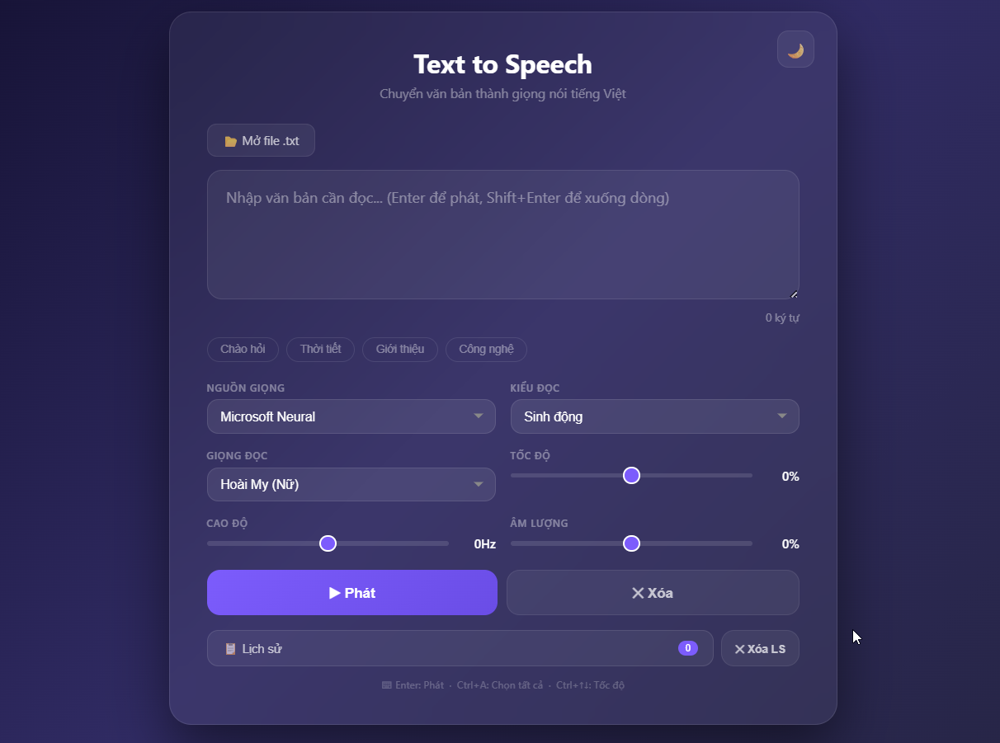

# Vietnamese TTS Web

Ứng dụng Text-to-Speech tiếng Việt với giao diện web, hỗ trợ nhiều engine TTS và điều khiển ngắt nghỉ tự nhiên.



## Tính năng

### 3 Engine TTS

| Engine | Yêu cầu | Chất lượng |
|--------|---------|------------|
| **Edge TTS** (Microsoft Neural) | Internet | Giọng AI tự nhiên nhất, hỗ trợ chỉnh tốc độ/cao độ/âm lượng, chế độ sinh động |
| **Google TTS** (gTTS) | Internet | Ổn định, nhẹ, không cần cấu hình |
| **Piper TTS** | Offline | Chạy trên CPU, nhẹ, mượt — phù hợp máy không có Internet |

### Chế độ đọc
- **Bình thường** — đọc toàn bộ văn bản một giọng đều
- **Sinh động** — tự động chia câu, lên giọng ở câu hỏi, nhấn mạnh câu cảm thán, cao độ biến thiên (Edge TTS)

### Điều khiển ngắt nghỉ (`viet_tts_controller/`)
Module riêng cho phép chèn khoảng lặng theo ngữ cảnh — hỗ trợ 4 chế độ:

| Chế độ | Mô tả | Phù hợp |
|--------|-------|---------|
| `news` | Dứt khoát, nhịp nhanh | Đọc tin tức |
| `story` | Chậm rãi, giàu cảm xúc | Kể chuyện, dẫn chương trình |
| `audiobook` | Chậm, ngắt nghỉ sâu | Sách nói |
| `youtube` | Nhanh, gọn | Video YouTube, podcast |

Các mốc ngắt (comma, period, paragraph...) đều có thể tuỳ chỉnh trong `viet_tts_controller/profiles.json`.

### Giao diện
- Theme **sáng/tối** (nút góc phải)
- Lịch sử **20 đoạn gần nhất** (lưu localStorage), click để phát lại
- **Đọc file .txt**
- **Text mẫu** (4 mẫu)
- **Tải file MP3** sau khi phát
- **Phím tắt**:
  - `Enter` — Phát
  - `Shift + Enter` — Xuống dòng
  - `Ctrl + ↑ / ↓` — Tăng/giảm tốc độ

### Công cụ đi kèm
- **`download_piper_voice.py`** — Tải giọng Piper từ HuggingFace, xem danh sách giọng có sẵn

## Yêu cầu

- **Python 3.8+** (đã test trên 3.12)
- **ffmpeg** (cho chế độ Sinh động — [tải ffmpeg](https://ffmpeg.org/))
- ~200MB ổ cứng cho môi trường + giọng Piper nếu dùng offline

## Cài đặt

### 1. Clone repo

```bash
git clone https://github.com/Bkhangg/vietnamese-tts-web.git
cd vietnamese-tts-web
```

### 2. Tạo môi trường ảo (khuyên dùng)

```bash
python -m venv venv
.\venv\Scripts\activate    # Windows
source venv/bin/activate   # Linux/macOS
```

### 3. Cài thư viện

```bash
pip install -r requirements.txt
```

**Nội dung `requirements.txt`**:
- `flask>=3.0` — Web server
- `pydub>=0.25` — Xử lý audio
- `edge-tts>=7.0` — Microsoft Neural TTS
- `gTTS>=2.5` — Google TTS
- `piper-tts>=1.4` — Piper offline TTS

> **Lưu ý Python 3.13+**: Cần cài thêm `pip install audioop-lts` để tránh lỗi "No module named 'pyaudioop'".

### 4. Tải giọng Piper (tùy chọn — chỉ cần nếu dùng Piper)

```bash
# Xem danh sách giọng có sẵn
python download_piper_voice.py

# Tải giọng (ví dụ)
python download_piper_voice.py en_US-lessac-medium
```

Giọng sẽ được đặt vào `models/piper/`. Mặc định đã có sẵn `en_US-lessac-medium`.

### 5. Chạy ứng dụng

```bash
python app.py
```

Mở trình duyệt tại **http://127.0.0.1:5000**

## Cấu trúc dự án

```
vietnamese-tts-web/
├── app.py                          # Flask app chính
├── templates/index.html            # Giao diện web
├── requirements.txt                # Danh sách thư viện
├── download_piper_voice.py         # Công cụ tải giọng Piper
├── models/piper/                   # Giọng Piper (.onnx + .json)
├── viet_tts_controller/            # Module điều khiển ngắt nghỉ
│   ├── config.py                   # Load cấu hình profiles
│   ├── profiles.json               # Ngưỡng ngắt cho từng chế độ
│   ├── text_analyzer.py            # Phân tích câu, dấu câu
│   ├── silence_engine.py           # Tạo audio silent, ghép batch
│   ├── controller.py               # VietnameseTTSController
│   └── example.py                  # Ví dụ sử dụng controller
├── images/anh.png                  # Ảnh minh hoạ
└── README.md
```

## API

### `POST /speak`

```json
{
  "text": "Xin chào Việt Nam!",
  "engine": "edge",
  "voice": "female",
  "rate": "0",
  "pitch": "0",
  "volume": "0",
  "lively": false,
  "piper_voice": "en_US-lessac-medium"
}
```

| Tham số | Kiểu | Mặc định | Mô tả |
|---------|------|----------|-------|
| `text` | string | — | Văn bản cần đọc |
| `engine` | string | `edge` | `edge` / `google` / `piper` |
| `voice` | string | `female` | `female` (Hoài My) / `male` (Nam Minh) — chỉ Edge |
| `rate` | string | `0` | Tốc độ (-50 đến 50) — chỉ Edge |
| `pitch` | string | `0` | Cao độ (-50 đến 50) — chỉ Edge |
| `volume` | string | `0` | Âm lượng (-50 đến 50) — chỉ Edge |
| `lively` | bool | `false` | Chế độ sinh động — chỉ Edge |
| `piper_voice` | string | — | Tên giọng Piper (VD: `en_US-lessac-medium`) — chỉ Piper |

Trả về file MP3 (hoặc WAV nếu không convert được).

### `GET /voices`

Danh sách giọng Edge TTS.

### `GET /engines`

Danh sách engine có sẵn.

### `GET /piper-voices`

Danh sách giọng Piper đã tải.

## Lưu ý

- **Edge TTS và Google TTS cần Internet** để hoạt động
- **Piper** đọc tiếng Anh nên sẽ tự động loại bỏ dấu tiếng Việt (NFD normalization) thành chữ không dấu để đọc được
- File `.onnx` giọng Piper khá lớn (~60MB/giọng) — GitHub khuyến nghị dùng [Git LFS](https://git-lfs.github.com/) cho file >50MB
- Nếu dùng chế độ Sinh động, cần **ffmpeg** để pydub ghép audio
- Đã test trên Windows 11 + Python 3.12.9
